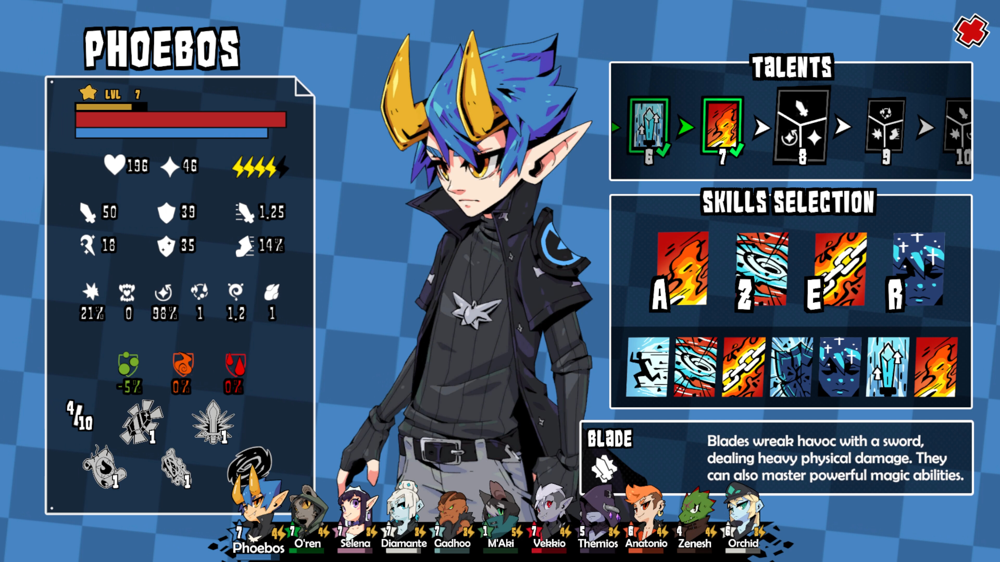
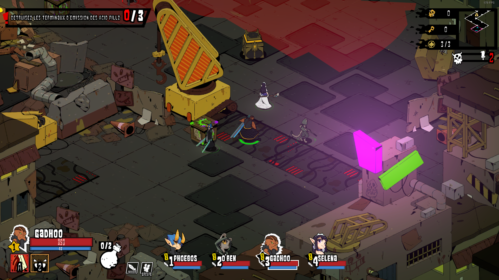
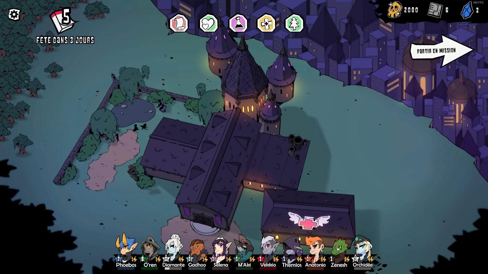
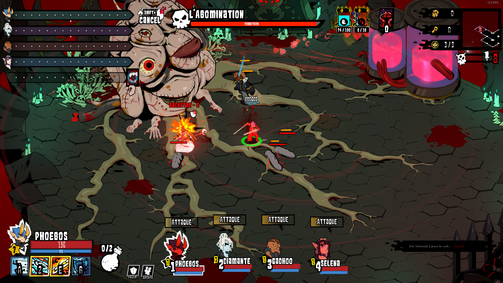

Blade Prince Academy ! Mon plus gros projet à ce jour ! C'est le premier jeu du studio Angel Corp, entreprise basé à Saint-Etienne j'ai rejoint en Septembre 2020.  
Le développement de Blade Prince Academy a duré 4 ans et a mobilisé une équipe d'une quarantaine de personne au plus fort du développement.
<!--more-->

 

Blade Prince Academy utilise un véritable système de combat en temps réel avec pause donnant ainsi un contrôle total sur les différents membres de l'escouade.
Manipulez l’ordre et le timing de chaque attaque pour planifier et réaliser le combo parfait.
Esquivez les attaques et sorts ennemis tout en gardant vos personnages au top de leur forme.

Le jeu est inspiré de Pillar or Eternity dans sa bouble de gameplay principale. Vous gérez une équipe de 4 héros (parmis une douzaine jouable) et partez en mission dans une ville en proie aux guerres de gangs et de cultes.
Les combats sont en temps réel mais vous pouvez mettre en pause a tout moment pour analyser la situation et planifier des combos. Chaque héro possède son style de combat et vous pouvez sélectionner 4 aptitudes parmis une dizaine pour chacun d'entre eux.

La DA est très inspirée Anime japonais. Nous avons fais le choix de mélanger personnages en 3D et décors en 2D pour donner un look unique au jeu.

Le HUB principal est améliorable afin de rendre le jeu plus facile en prenant le temps de gagner de l'experience et des ressources.
En dehors des missions, vous devez gérer la fatigue des héros, leur équipement, organiser des fêtes étudiante...

Les boss sont un gros pic de difficulté et demande une parfaite maitrise de ses personnages.
