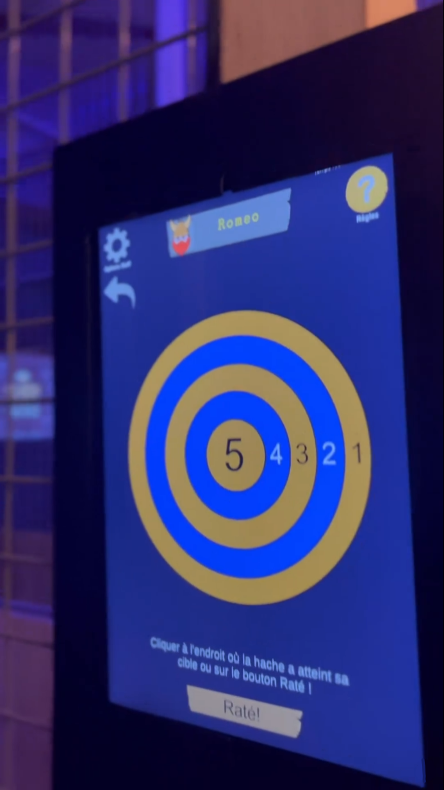
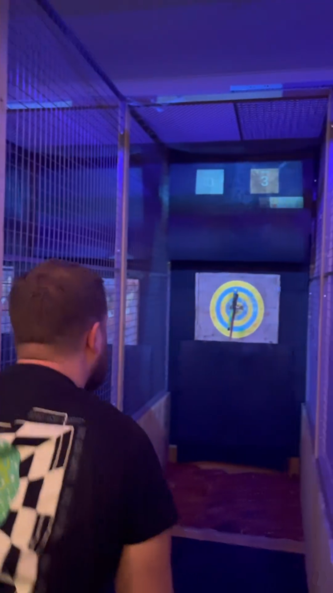

Clash de Haches est un centre de Lancer de Haches situé à Andrézieux près de Saint-Etienne. 
J'ai développé pour eux un logiciel sur tablette reliée a un projecteur qui projette des mini-jeux sur cible en bois.
<!--more-->

Pour rendre le lancer de hache plus fun, les fondateurs de Clash de Haches m'ont contacté afin que je leur développe une série de mini-jeux. 

<table>
  <tbody>
    <tr>
      <th></th>
	  <td></td>
	  <th></th>
    </tr>
    <tr>
      <th></th>
      <td></td>
	  <th></th>
    </tr>
  </tbody>
</table>

