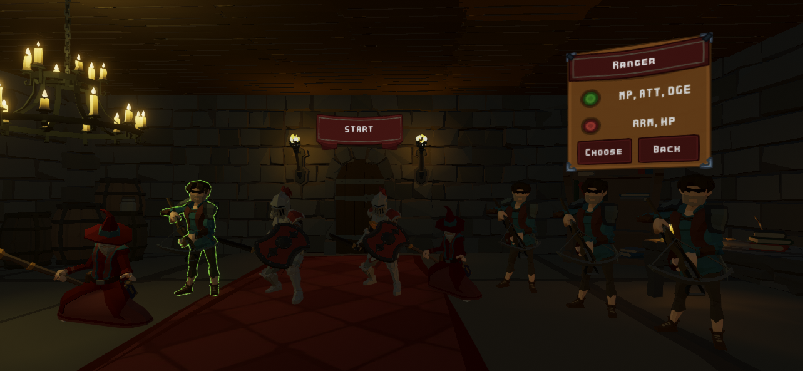

---
title: "Depths' Adventures"
date: 2020-01-10
categories: ["Projets","UQAC"]
tags: ["Unity","C#"]
hero: Combat.png
---

Depths' Adventures est un Tactical RPG - Rogue Like créé sous Unity par 6 étudiants pendant 4 mois.

<!--more-->

Le jeu est téléchargeable  [ici !](https://drive.google.com/uc?export=download&id=1oR8rAxkfSnTlyQKI769GPeC0Euno9SlR)

Pour le cours de Laboratoire de Jeux Vidéo à l'UQAC , nous avons dû réaliser un jeu sous Unity en un trimestre.
Notre équipe a choisi de créer un Tactical RPG - Rogue Like dans un univers Fantasy
J'ai été en charge des fonctionnalités de combats , de la création des sorts et de divers éléments graphiques.
Nous avons obtenu la note de 4.0 sur 4,33.

Lien Youtube du trailer : (cliquez sur l'image) 

L'écran d'accueil dans une ambiance taverne permet de choisir les aventuriers qui vont parcourir le donjon ainsi que des "tokens",
des bonus à assigner à chaque personnage pour leur apporter des bonus / malus.

Les tokens se débloquent en finissant un étage du donjon. Ils ont plusieurs niveaux de raretés et apportent divers bonus ou malus.
Par exemple le token "Oak Rune" apporter +2 Points de vies  mais -1 en Magie.

Vient ensuite le choix des aventuriers , une équipe est composée de maximum 4 personnages mais le joueur peut choisir de prendre
une équipe plus réduite pour un plus grand challenge.
Le Guerrier est fort en attaque physique et en contrôle des monstres , mais n'attaque pas à distance.
Le Mage a des sorts très puissants mais est très fragile.
Le Ranger est rapide et peut ralentir les ennemis , mais il est faible au contact.

Ce jeu est un rogue-like car les niveaux du donjon sont générés aléatoirement, les salles et les ennemis seront différents d'une partie
à l'autre. On dirige l'équipe d'aventuriers en cliquant sur leur destination. Les points jaunes permettent de passer d'une salle à une autre.
A chaque entrée dans une nouvelle salle , un combat se déclenche

Dans l'inventaire, on peut voir les caractéristiques des aventuriers et leur assigner des tokens. Lorsque les aventuriers gagnent des combats,
ils gagnent de l'expérience et peuvent gagner un niveau. Cela améliore leurs caractéristiques et ils gagnent un point de compétence à dépenser dans
l'arbre des sorts.

Les combats se font au tour par tour. Chaque personnage / monstre possède un nombre fixe de points de déplacement et de points d'actions à dépenser en un tour. Les aventuriers disposent de sorts offensifs (au corps à corps ou à distance) ainsi que des sorts de "buff" pour aider les alliés. Les aventuriers de haut niveaux disposent de sorts très puissants mais coûteux pouvant retourner le cours d'une bataille.

