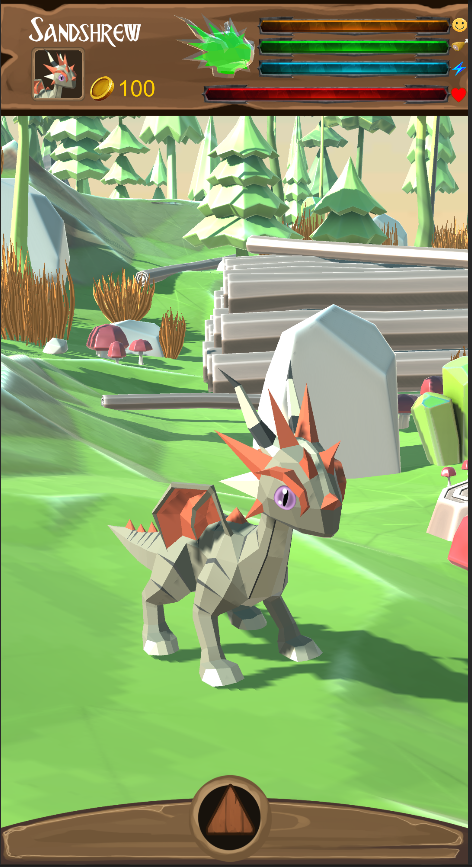
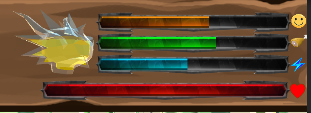
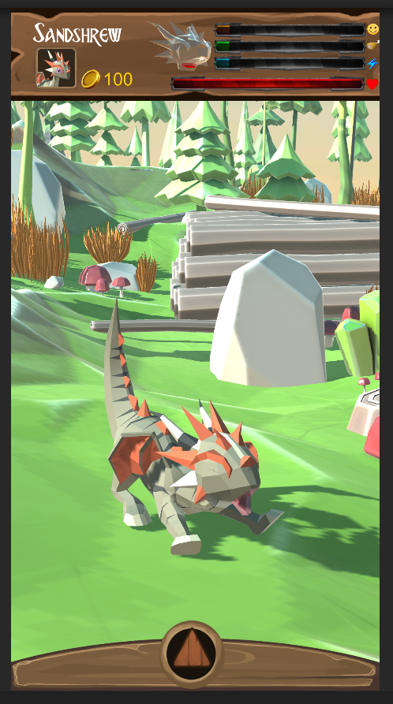
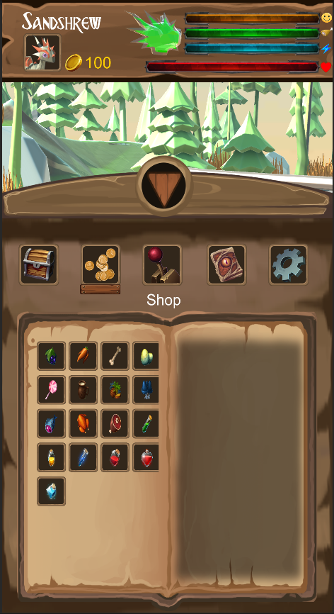
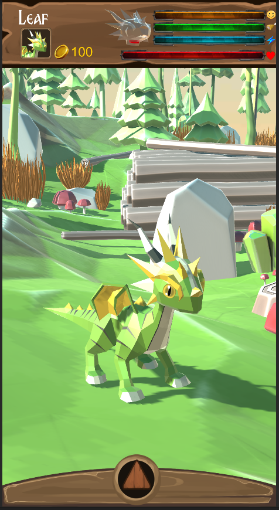

Dragon Garden est un tamagotchi-like sur lequel j'ai travaillé durant le confinement afin de continuer à améliorer mes connaissances de Unity et de la programmation de jeux mobiles 

<!--more-->
Le principe du jeu est comme les tamagotchi , il faut veiller au bien-être de son dragon en le nourrissant régulièrement, en jouant avec lui et en le faisant dormir. 

Si la moyenne de ses 3 besoins est trop basse , il va commencer a perdre de la vie. Le calcul des besoins de fait grâce à l'horloge du smartphone , ainsi lorsque le joueur relance l'application les barres ont diminués.
Le joueur recoit des notifications si les besoins deviennent bas.

Le dragon est entièrement animé et joue des animations aléatoirements ou selon ses besoins( baillement par exemple )

Le menu du bas contient l'inventaire, le magasin, les mini-jeux, la possibilité de "partager" son dragon en bluetooth et les paramètres. 

La génération du dragon est aléatoire , il sera différent pour chaque joueur.

Ce projet est en suspens et loin d'être terminé , j'ajouterai du contenu sur cette page au fur et à mesure de ma progression.