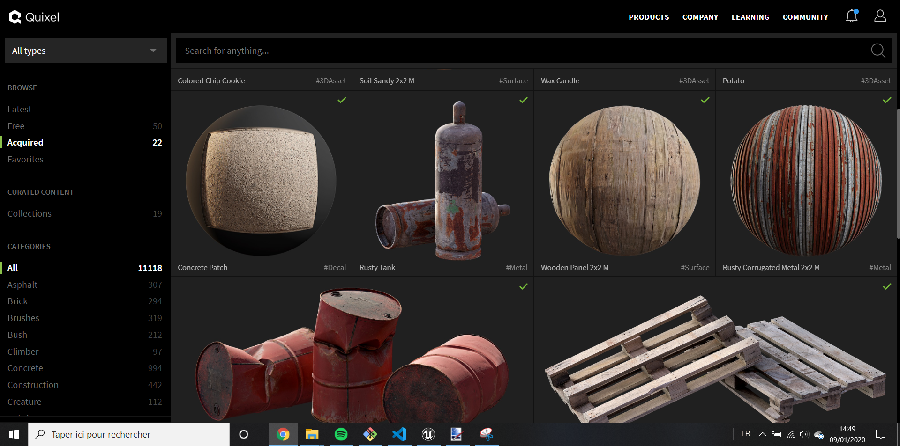
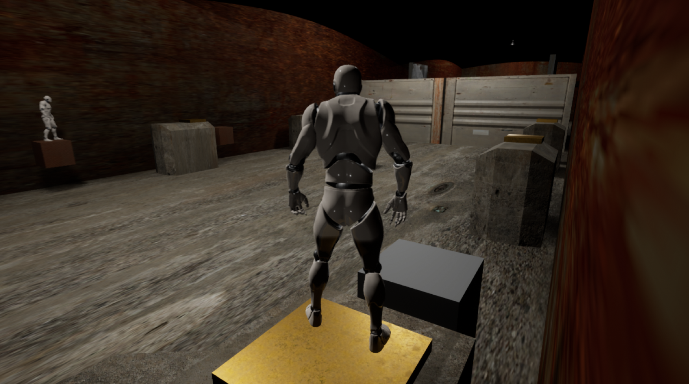
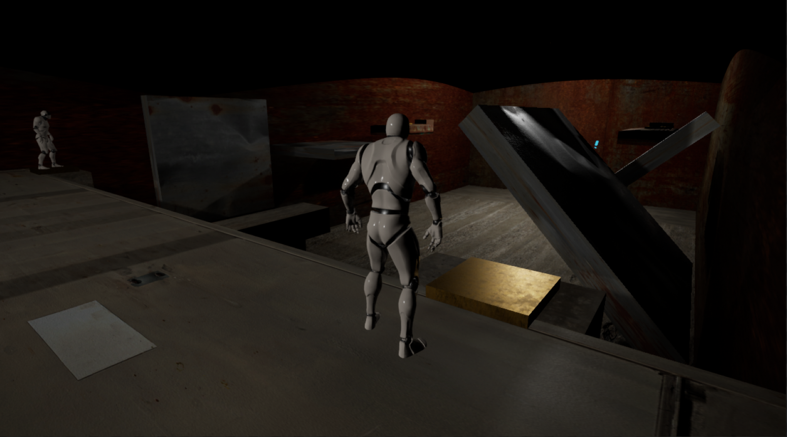
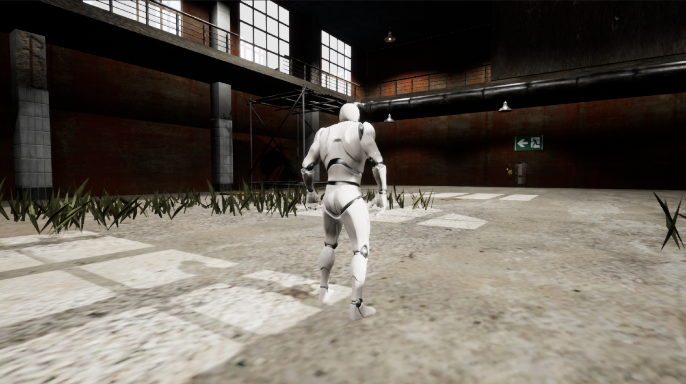
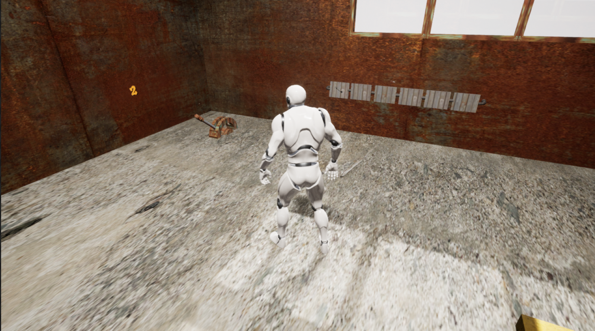

Escape Unreal est un jeu de plateforme et escape game réalisé sur Unreal Engine par 3 étudiants en 2 mois.

<!--more-->

Durant le cours de Programmation de Jeu en Réseau , nous avons développé un mini jeu de plateforme & coopération sur Unreal Engine.
Nous avons utilisé à la fois des scripts en C++ et des Blueprints.

Nous avons utilisé le personnage standard d'Unreal prêt à l'emploi car le but était d'apprendre à gérer le multijoueur , en particulier la réplication et les Remote Procedure Calls, ainsi que les bonnes pratiques C++.

Les textures viennent de Quixel Megascan , qui fournit gratuitement aux utilisateurs d'Unreal Engine des textures photoréalistes jusqu'à 8K de résolution.

Dans le niveau 1 , les joueurs doivent se placer sur des plaques de pressions qui font bouger les plateformes de l'autre joueur et ainsi de suite. 

Le niveau 2 ressemble à une Escape Room , les joueurs doivent trouver la bonne combinaison de levier pour sortir du hangar. Des plaques de pressions font tourner des panneaux qui révèlent le code et les joueurs doivent trouver les leviers correspondants et les activer. 

