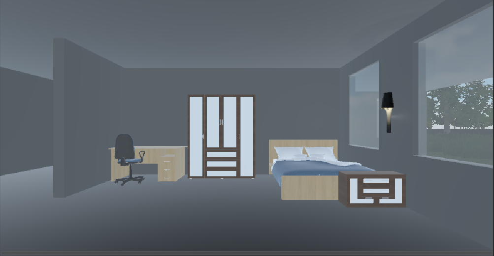
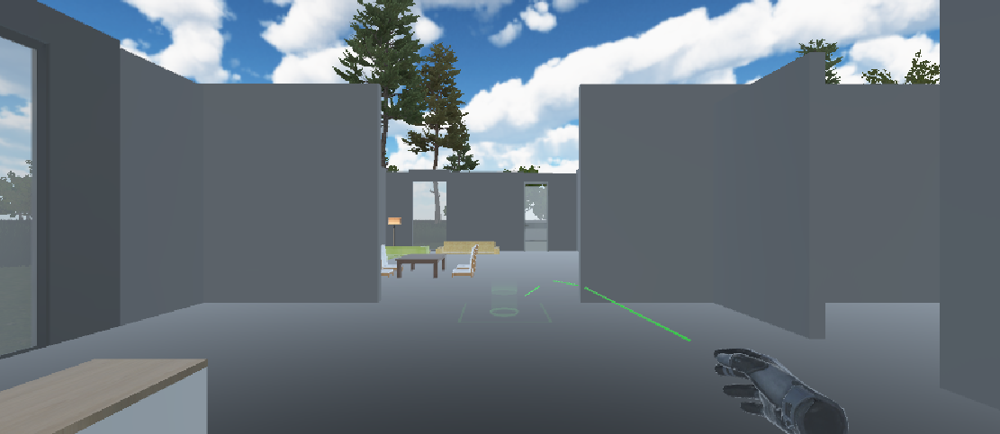
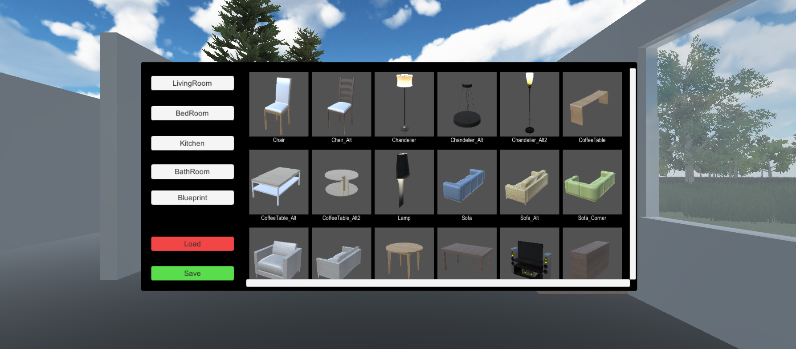
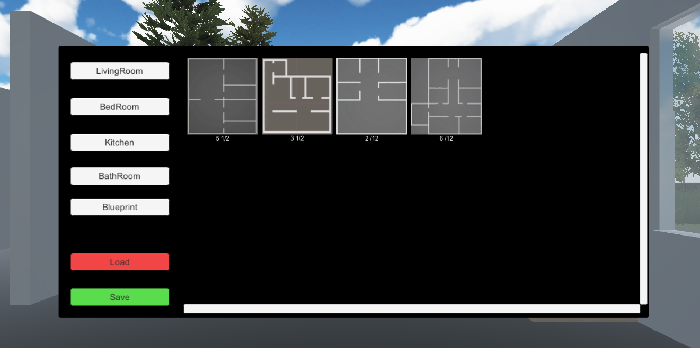
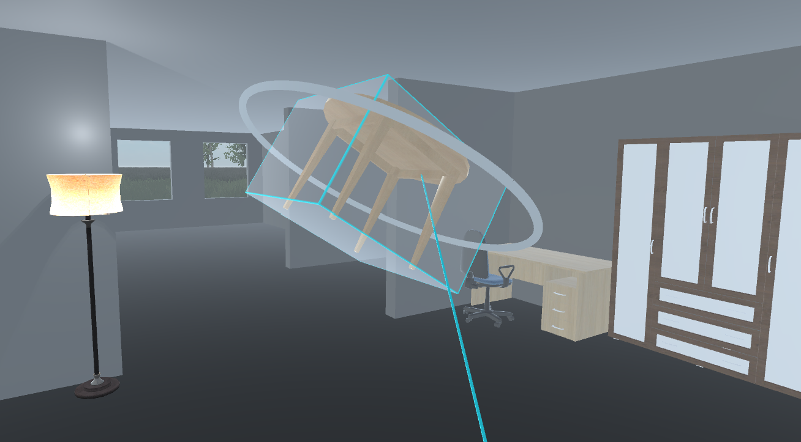

VR Home est logiciel fait grâce à Unity et Steam VR qui permet de tester des agencements de meubles en Réalité Virtuelle.
Ce projet a été réalisé par une équipe de 3 étudiants pour le cours d'Interaction 3D et réalité virtuelle.

<!--more-->

Pour ce cours, nous devions créer un "serious game" en réalité virtuelle avec Oculus ou HTC Vive en 2 mois . Notre équipe a choisi de réaliser un logiciel de design d'intérieur. Nous avons obtenu la note de 18 sur 20.

L'utilisateur se déplace en se téléportant grâce au système de téléportation de SteamVR, il peut se déplacer librement dans les différentes pièces
des maisons et tourne sur lui même pour changer l'orientation du personnage.

En appuyant sur le bouton A (sur la main droite) ou le bouton X (sur la main gauche) l'interface s'ouvre et suit les mouvements de la tête de l'utilisateur. En pointant son index sur l'interface, l'utilisateur fait apparaitre une ligne de sélection qui lui permet de cliquer sur les différents boutons en utilisant les triggers des contrôleurs. Grâce à cette interface , l'utilisateur peut faire apparaitre des meubles sur les scènes et les placer où il le désire. Il peut changer l'agencement de la maison et le nombre de pièces dans l'onglet "Blueprints".
Grâce aux boutons "Save" et "Load", la disposition des meubles est sauvegardée et peut être chargée pour continuer plus tard.

Les touches "Grab" des contrôleurs Oculus permettent d'attraper un objet pointé par le joueur, il peut ainsi le déplacer en bougeant ses mains et utiliser les sticks pour faire tourner le meuble selon les 3 axes de rotation, un cercle blanc apparait pour indiquer quel est l'axe de rotation actuel

